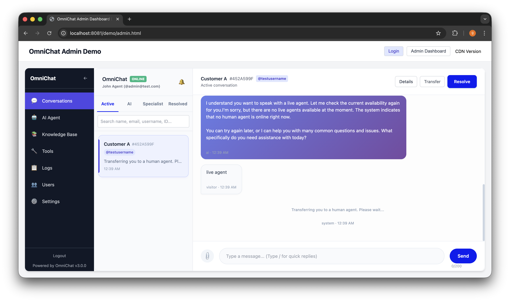
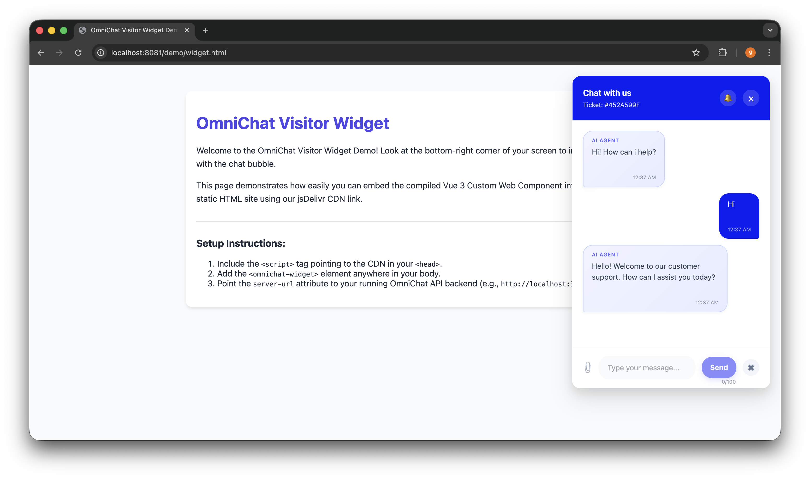
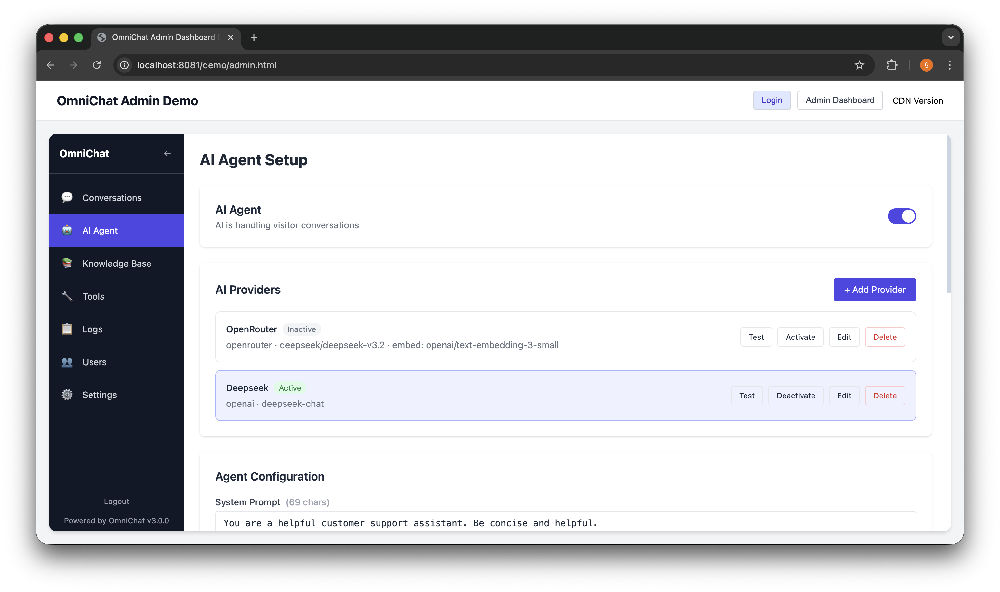
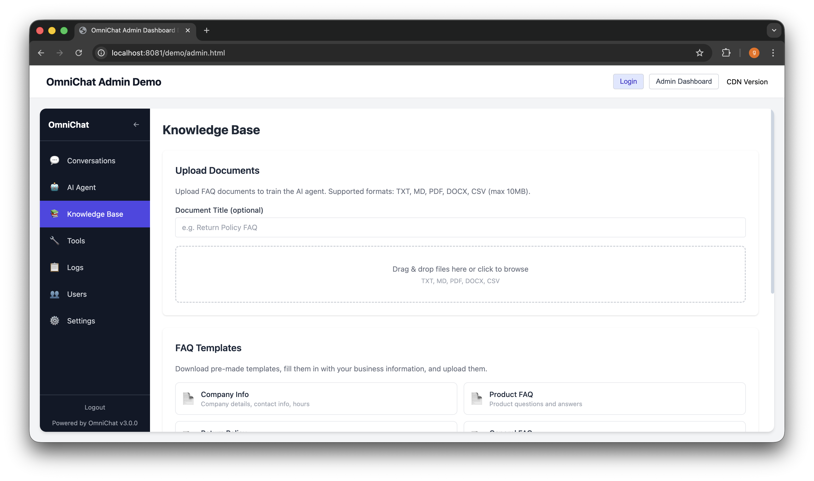

# 💬 OmniChat


**OmniChat** is a high-performance, self-hosted, and open-source communication suite. It features a lightweight Vue 3 widget for instant visitor engagement and a RAG-ready AI agent that answers questions using your own data. Built for extensibility, developers can effortlessly embed the chat interface into any website and integrate the powerful agent dashboard directly into their existing backoffice.

<div align="center">
  
  
  
  
</div>

## ✨ Features

* **⚡ Real-time Communication**: Powered by Socket.io for sub-millisecond latency.
* **💾 Multi-Database Support**: Thanks to Prisma, OmniChat supports **MongoDB, PostgreSQL, and MySQL**.
* **🎫 Ticket ID Tracking**: Customers receive a unique 8-character Ticket ID (e.g., `#A8B7C6D5`) to easily track and reference their cases in the future.
* **👨‍⚕️ Specialist Transfers**: Easily transfer active chats to specialized agents. The specialized agent will receive a notification and the chat will appear in their dedicated "Specialist" tab.
* **🔍 Smart Search & Filters**: Search conversations by specific prefixes (`@username`, `#ticketID`) and filter resolved chats by date ranges in the agent's local timezone.
* **🌐 Cross-Tab Persistence**: Visitors can navigate across your site or open new tabs without losing their chat session.
* **🕵️ Visitor Context Tracking**: Automatically captures and displays visitor IP, Browser, OS, Device, Current URL, Timezone, Language, and Referrer.
* **🖼️ Smart Image Uploads**: 
   * Client-side image compression (Canvas).
   * Backend thumbnail generation using `sharp`.
   * **HEIC/HEIF support** - Automatic conversion to WebP via ImageMagick.
   * Built-in UI Lightbox for viewing high-res images.
   * Cross-platform HEIC conversion (macOS, Ubuntu, Windows Server).
* **⚡ Quick Replies**: Admins can configure canned responses and trigger them in chat by simply typing `/`.
* **⏱️ Auto-Resolution**: Automatically sends a 3-minute inactivity warning and resolves inactive chats after 5 minutes.
* **🎨 Highly Customizable Widget**: Change bubble colors, patterns, sizes, icons, and welcome messages directly from the Admin UI. Dynamic CORS configuration stored in the database.
* **⭐ Post-Chat Reviews**: Collect visitor feedback and star ratings after a conversation is resolved.

**🤖 AI Agent**

* OmniChat includes optional AI Agent support for automated visitor conversations and human handoff orchestration.
* Human Offline Mode: when enabled, visitors are prevented from being routed to human agents. If AI Agent is enabled, visitors will be served by the AI Agent when humans are offline.
* Handoff logic: transfers to humans only succeed when an agent is truly available (presence is session-aware and requires an active, online agent session).
* Read receipts: agents can see visitor read status when enabled; visitors never see read receipts in the widget.
* Character limits: visitor messages are limited to 100 characters and agent/admin messages to 1000 characters (enforced client- and server-side).
* Quick Replies and canned responses work with both human and AI-driven conversations and are validated server-side (title/content limits).
* Messages support Markdown rendering (sanitized HTML) for both AI and human messages; streaming behavior is supported but should be tested during integration.
* Configuration: AI Agent settings (enable/disable, greetings, system prompt, human offline mode, read receipts) are available in the Admin Settings and Ai Setup pages. See docs/ai-agent.md for full details.

## 🛠️ Tech Stack

This project is structured as a Bun workspace monorepo:

* **Backend (`apps/api`)**: NestJS, Prisma (MongoDB, PostgreSQL, MySQL), Socket.io, Multer, Sharp.
* **Frontend (`apps/web`)**: Vue 3 (compiled to Custom Web Components via Vite).

## 🧩 Widget Usage & Attributes

OmniChat is compiled into native Web Components, meaning you can drop them into any framework (React, Angular, Vue, Blazor) or plain HTML.

### Client Visitor Widget (`<omnichat-widget>`)
```html
<omnichat-widget
  server-url="https://api.yoursite.com"
  bubble-color="#4F46E5"
  welcome-message="Hello! How can we help you?"
  position="bottom-right"
  assign-username="logged_in_user123">
</omnichat-widget>
```
**Supported Attributes:**
* `server-url` (Required): The base URL of your OmniChat backend API.
* `bubble-color` (Optional): Hex color code for the chat widget theme (defaults to `#4F46E5`). Can be overridden by backend site config.
* `welcome-message` (Optional): The default greeting message. Can be overridden by backend site config.
* `position` (Optional): Where the widget renders on the screen (defaults to `bottom-right`).
* `assign-username` (Optional): Automatically link an authenticated visitor's username to their chat session for tracking.

### Admin Dashboard Widget (`<omnichat-admin>`)
```html
<omnichat-admin
  server-url="https://api.yoursite.com"
  token="eyJhbGciOiJIUzI1NiIsInR...">
</omnichat-admin>
```
**Supported Attributes:**
* `server-url` (Required): The base URL of your OmniChat backend API.
* `token` (Required): The JWT authentication token for the logged-in agent/admin.

## 🚀 Quick Start

### 🐳 Docker Deployment (Recommended)

OmniChat includes full HEIC image support and can be deployed using Docker with pre-configured ImageMagick conversion:

#### Quick Start with Docker

**Linux/macOS:**
```bash
./deploy-docker.sh
```

**Windows (PowerShell):**
```powershell
PowerShell -ExecutionPolicy Bypass -File deploy-docker.ps1
```

**Manual:**
```bash
docker compose up -d --build
```

The Docker deployment includes:
- ✅ Bun runtime for optimal performance
- ✅ ImageMagick with HEIC support
- ✅ Cross-platform compatibility (macOS, Ubuntu, Windows Server)
- ✅ Pre-configured environment
- ✅ Persistent volume mounts

### 💻 Manual Deployment (No Docker)

For developers who prefer manual installation and direct system control, OmniChat can be deployed without Docker by installing ImageMagick and other dependencies directly on the server OS.

#### Quick Start with Manual Setup

**Ubuntu Server:**
```bash
# Install ImageMagick with HEIC support
sudo apt install imagemagick libheif-dev

# Install Bun
curl -fsSL https://bun.sh/install | bash

# Clone and setup
git clone <repository-url>
cd omnichat
bun install
bun run prisma:generate
bun run prisma:push
bun run build:api
bun run dev:api
```

**Windows Server:**
```powershell
# Download and install ImageMagick
https://imagemagick.org/script/download.php#windows

# Install Bun
irm bun.sh/install.ps1 | iex

# Clone and setup
git clone <repository-url>
cd omnichat
bun install
bun run prisma:generate
bun run prisma:push
bun run build:api
bun run dev:api
```

**macOS:**
```bash
# Install ImageMagick (optional - sips works as fallback)
brew install imagemagick

# Install Bun
curl -fsSL https://bun.sh/install | bash

# Clone and setup
git clone <repository-url>
cd omnichat
bun install
bun run prisma:generate
bun run prisma:push
bun run build:api
bun run dev:api
```

For comprehensive manual deployment instructions, see [Manual Deployment Guide](MANUAL_DEPLOYMENT.md).

#### Deployment Comparison

| Aspect | Docker Deployment | Manual Deployment |
|--------|------------------|-------------------|
| **Setup Complexity** | Low (single command) | Medium (manual installation) |
| **HEIC Support** | Pre-configured | Manual ImageMagick setup required |
| **Cross-platform** | Guaranteed | Platform-specific steps |
| **Performance** | Slight container overhead | Direct system access |
| **Maintenance** | Container updates | System package updates |
| **Code Changes** | None | None |
| **Functionality** | Identical | Identical |

Both deployment methods provide **identical HEIC conversion functionality**. Choose Docker for simplified setup and consistency, or manual deployment for maximum control and performance.

#### CDN Links

You can easily embed OmniChat via CDN:

* **Admin Portal Widget**: `https://cdn.jsdelivr.net/gh/garyhooi/omnichat@main/apps/web/dist/omnichat-admin.js`
* **Client Visitor Widget**: `https://cdn.jsdelivr.net/gh/garyhooi/omnichat@main/apps/web/dist/omnichat-client.js`

### Prerequisites
* Bun
* A database of your choice (MongoDB, PostgreSQL, or MySQL)

### Installation

1. **Clone the repository:**
   ```bash
   git clone https://github.com/garyhooi/omnichat.git
   cd omnichat
   ```

2. **Install dependencies:**
    ```bash
    bun install
    ```

3. **Environment Setup:**
    * Navigate to `apps/api` and copy `.env.example` to `.env`.
    * Update the `DATABASE_URL` to point to your database instance.
    * If not using MongoDB, you can switch providers using the included shell script: `bun run use-provider postgresql` or `bun run use-provider mysql` (Requires `scripts/use-provider.sh` to be executed).

4. **Sync the Database:**
    ```bash
    bun run prisma:generate
    bun run prisma:push
    ```

5. **Run the Development Servers:**
    * **API Server:** 
      ```bash
      bun run dev:api
      ```
    * **Web/Frontend Builder:** 
      ```bash
      bun run dev:web
      ```

## File Structure Reference

```
omnichat/
├── apps/
│   ├── api/                        ← NestJS backend
│   │   ├── src/
│   │   │   ├── chat/
│   │   │   ├── auth/
│   │   │   └── config/
│   │   ├── prisma/
│   │   │   ├── schema.prisma
│   │   │   ├── schema.mongodb.prisma
|   |   |   ├── schema.postgresql.prisma
│   │   │   └── schema.mysql.prisma
│   │   └── .env.example
│   └── web/                        ← Vue 3 Web Components
│       ├── src/
│       │   ├── admin/
│       │   │   ├── App.ce.vue
│       │   │   └── main.ts
│       │   └── client/
│       │       ├── App.ce.vue
│       │       └── main.ts
│       └── vite.config.ts
├── docker-compose.yml
└── scripts/
    └── use-provider.sh
```


## 📚 Documentation

For more detailed setup instructions, including Docker and Production deployments, please refer to the following guides:

* [Local Setup Guide](docs/SETUP_LOCAL.md)
* [Production Deployment Guide](docs/SETUP_PRODUCTION.md)
* [Quickstart Overview](docs/QUICKSTART.md)
* [Docker Deployment Guide](docs/DOCKER_DEPLOYMENT.md)
* [Manual Deployment Guide](docs/MANUAL_DEPLOYMENT.md)

## 🤝 Contributing

Contributions are welcome! If you'd like to improve OmniChat, please fork the repository and submit a Pull Request. For major changes, please open an issue first to discuss what you would like to change.

## 📄 License

This project is open-source and available under the [MIT License](LICENSE).
