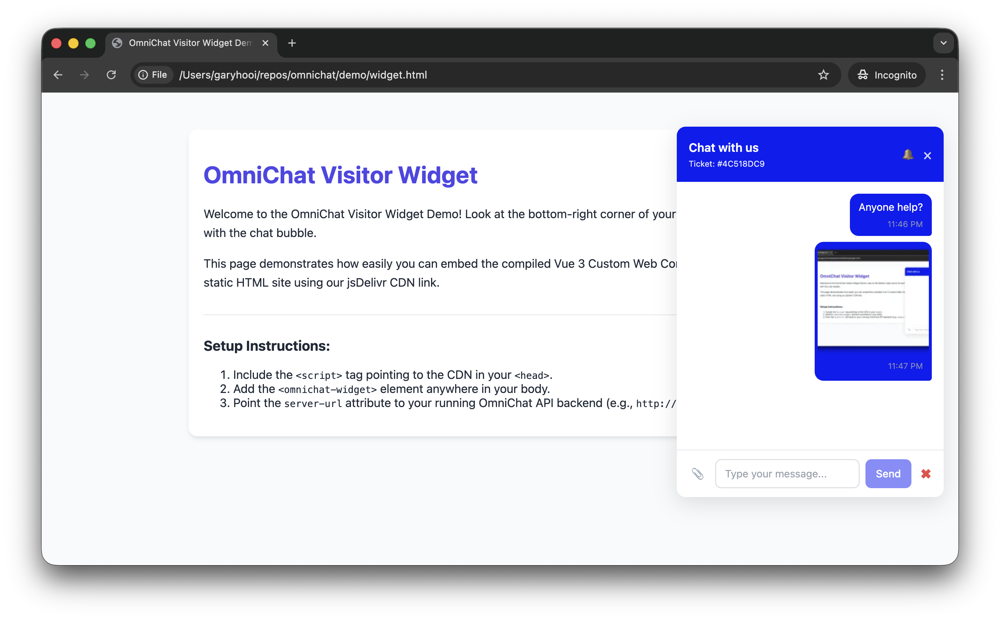
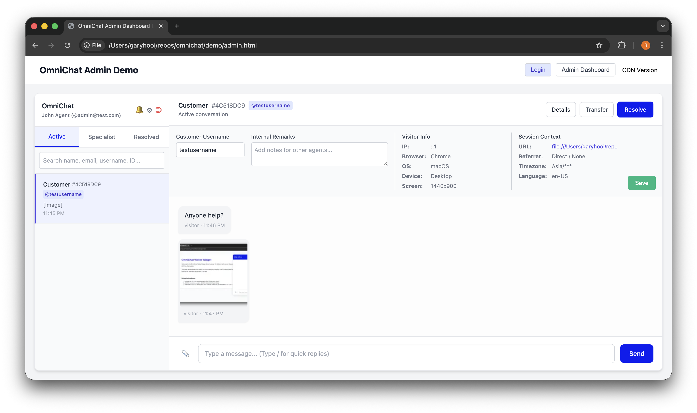

# 💬 OmniChat


**OmniChat** is a high-performance, self-hosted, and open-source live chat system designed for modern websites. It provides a lightweight embeddable Vue 3 widget for your visitors and a powerful dashboard for your support agents.

<div align="center">
  
  
</div>

## ✨ Features

* **⚡ Real-time Communication**: Powered by Socket.io for sub-millisecond latency.
* **💾 Multi-Database Support**: Thanks to Prisma, OmniChat supports **MongoDB, PostgreSQL, and MySQL**.
* **🎫 Ticket ID Tracking**: Customers receive a unique 8-character Ticket ID (e.g., `#A8B7C6D5`) to easily track and reference their cases in the future.
* **👨‍⚕️ Specialist Transfers**: Easily transfer active chats to specialized agents. The specialized agent will receive a notification and the chat will appear in their dedicated "Specialist" tab.
* **🔍 Smart Search & Filters**: Search conversations by specific prefixes (`@username`, `#ticketID`) and filter resolved chats by date ranges in the agent's local timezone.
* **🌐 Cross-Tab Persistence**: Visitors can navigate across your site or open new tabs without losing their chat session.
* **🕵️ Visitor Context Tracking**: Automatically captures and displays visitor IP, Browser, OS, Device, Current URL, Timezone, Language, and Referrer.
* **🖼️ Smart Image Uploads**: 
  * Client-side image compression (Canvas).
  * Backend thumbnail generation using `sharp`.
  * Built-in UI Lightbox for viewing high-res images.
* **⚡ Quick Replies**: Admins can configure canned responses and trigger them in chat by simply typing `/`.
* **⏱️ Auto-Resolution**: Automatically sends a 3-minute inactivity warning and resolves inactive chats after 5 minutes.
* **🎨 Highly Customizable Widget**: Change bubble colors, patterns, sizes, icons, and welcome messages directly from the Admin UI. Dynamic CORS configuration stored in the database.
* **⭐ Post-Chat Reviews**: Collect visitor feedback and star ratings after a conversation is resolved.

## 🛠️ Tech Stack

This project is structured as an npm workspace monorepo:

* **Backend (`apps/api`)**: NestJS, Prisma (MongoDB, PostgreSQL, MySQL), Socket.io, Multer, Sharp.
* **Frontend (`apps/web`)**: Vue 3 (compiled to Custom Web Components via Vite).

## 🧩 Widget Usage & Attributes

OmniChat is compiled into native Web Components, meaning you can drop them into any framework (React, Angular, Vue, Blazor) or plain HTML.

### Client Visitor Widget (`<omnichat-widget>`)
```html
<omnichat-widget
  server-url="https://api.yoursite.com"
  bubble-color="#4F46E5"
  welcome-message="Hello! How can we help you?"
  position="bottom-right"
  assign-username="logged_in_user123">
</omnichat-widget>
```
**Supported Attributes:**
* `server-url` (Required): The base URL of your OmniChat backend API.
* `bubble-color` (Optional): Hex color code for the chat widget theme (defaults to `#4F46E5`). Can be overridden by backend site config.
* `welcome-message` (Optional): The default greeting message. Can be overridden by backend site config.
* `position` (Optional): Where the widget renders on the screen (defaults to `bottom-right`).
* `assign-username` (Optional): Automatically link an authenticated visitor's username to their chat session for tracking.

### Admin Dashboard Widget (`<omnichat-admin>`)
```html
<omnichat-admin
  server-url="https://api.yoursite.com"
  token="eyJhbGciOiJIUzI1NiIsInR...">
</omnichat-admin>
```
**Supported Attributes:**
* `server-url` (Required): The base URL of your OmniChat backend API.
* `token` (Required): The JWT authentication token for the logged-in agent/admin.

## 🚀 Quick Start

### CDN Links

You can easily embed OmniChat via CDN:

* **Admin Portal Widget**: `https://cdn.jsdelivr.net/gh/garyhooi/omnichat@main/apps/web/dist/omnichat-admin.js`
* **Client Visitor Widget**: `https://cdn.jsdelivr.net/gh/garyhooi/omnichat@main/apps/web/dist/omnichat-client.js`

### Prerequisites
* Node.js >= 18.0.0
* A database of your choice (MongoDB, PostgreSQL, or MySQL)

### Installation

1. **Clone the repository:**
   ```bash
   git clone https://github.com/garyhooi/omnichat.git
   cd omnichat
   ```

2. **Install dependencies:**
   ```bash
   npm install
   ```

3. **Environment Setup:**
   * Navigate to `apps/api` and copy `.env.example` to `.env`.
   * Update the `DATABASE_URL` to point to your database instance.
   * If not using MongoDB, you can switch providers using the included shell script: `npm run use-provider postgresql` or `npm run use-provider mysql` (Requires `scripts/use-provider.sh` to be executed).

4. **Sync the Database:**
   ```bash
   npm run prisma:generate
   npm run prisma:push
   ```

5. **Run the Development Servers:**
   * **API Server:** 
     ```bash
     npm run dev:api
     ```
   * **Web/Frontend Builder:** 
     ```bash
     npm run dev:web
     ```

## 📚 Documentation

For more detailed setup instructions, including Docker and Production deployments, please refer to the following guides:

* [Local Setup Guide](docs/SETUP_LOCAL.md)
* [Production Deployment Guide](docs/SETUP_PRODUCTION.md)
* [Quickstart Overview](docs/QUICKSTART.md)

## 🤝 Contributing

Contributions are welcome! If you'd like to improve OmniChat, please fork the repository and submit a Pull Request. For major changes, please open an issue first to discuss what you would like to change.

## 📄 License

This project is open-source and available under the [MIT License](LICENSE).
